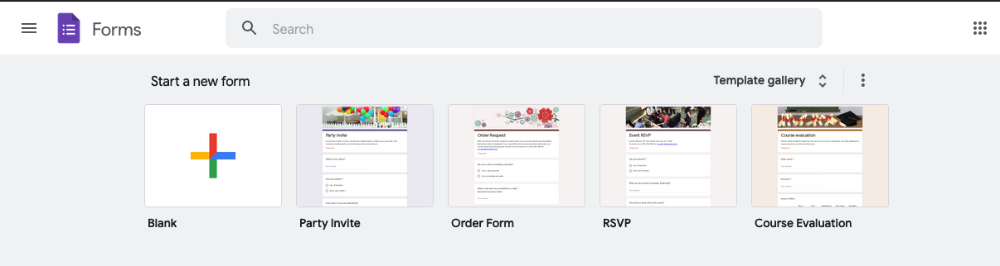
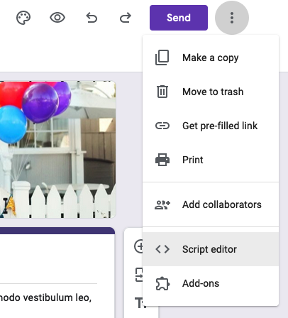
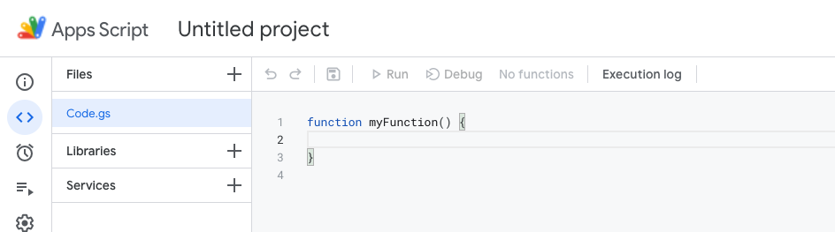
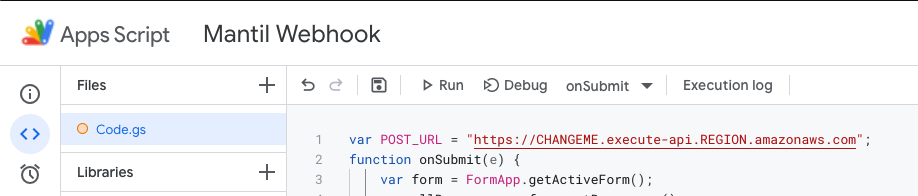
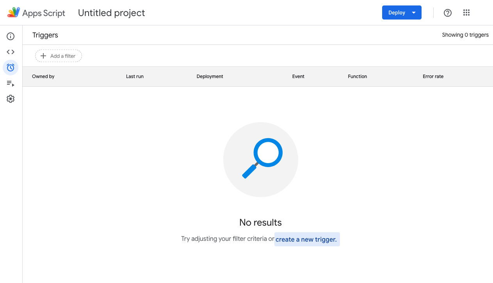
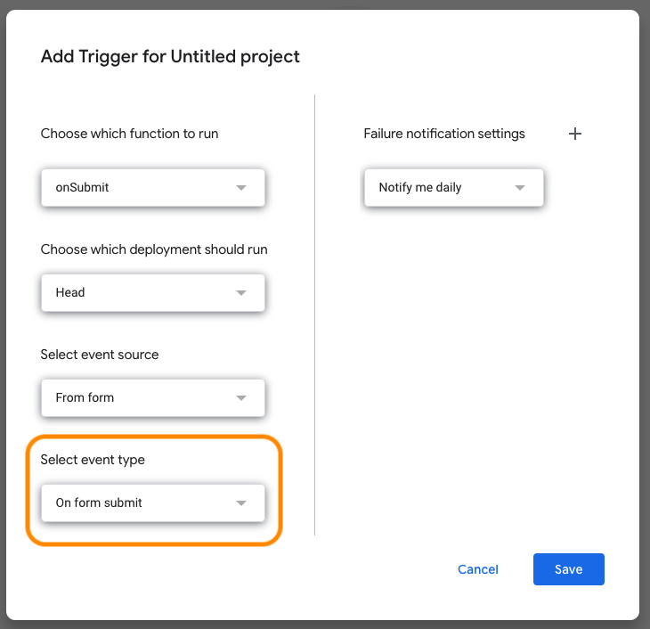
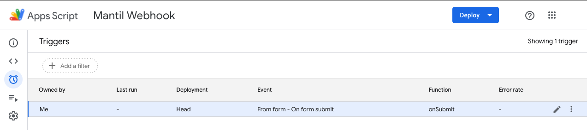
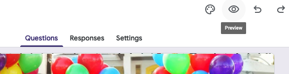
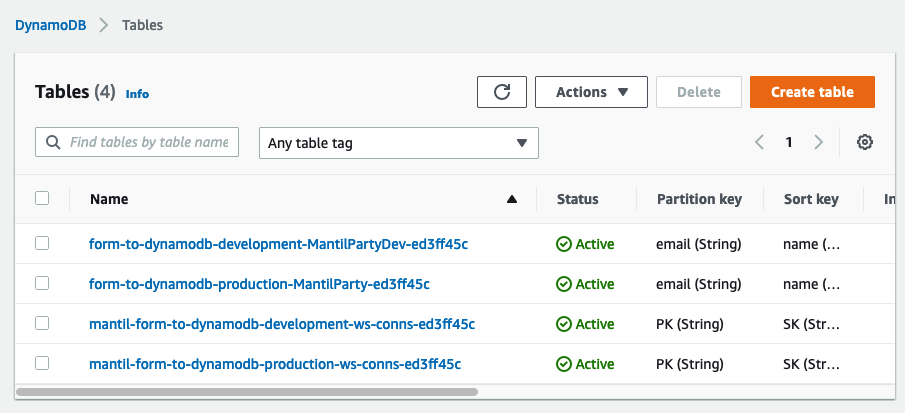

## About

This template is an example of serverless integration between Google Forms and DynamoDB. An AWS Lambda function built with Mantil receives data from a Google Form and saves the data to a DynamoDB table.

## Prerequisites

This template is created with Mantil. To download [Mantil CLI](https://github.com/mantil-io/mantil#installation) on Mac or Linux use Homebrew:

```
brew tap mantil-io/mantil
brew install mantil
```

or check [direct download links](https://github.com/mantil-io/mantil#installation).

To deploy this application you will need:
- An [AWS account](https://aws.amazon.com/premiumsupport/knowledge-center/create-and-activate-aws-account/)
- A Google account

## Installation

To locally create a new project from this template run:

```
mantil new app --from https://github.com/christophberger/mantil-template-form-to-dynamodb
cd app
```

## Setup


## Deploy the application

Note: If this is the first time you are using Mantil you will first need to install Mantil Node on your AWS account. For detailed instructions please follow these simple, one-step [setup instructions](https://github.com/mantil-io/mantil/blob/master/docs/getting_started.md#setup)

```
mantil aws install
```

Now you can deploy the appliation to AWS.

```
mantil deploy
```

This command will create a new stage for your project with default name `development` and deploy it to your node.

Now test the API by calling

```
mantil invoke form/list
```

This call lists all rows in the database table. Initially, there are none, and so the result is empty. You'll see some log output that shows that everything works fine.

```
$ mantil invoke form/list
λ github.com/mantil-io/go-mantil-template/api/form/form.go:81: List called
λ github.com/mantil-io/go-mantil-template/api/form/form.go:88: 0 []
```

To fill the table with data, we will use a Google form.


## Deploy a Google Form

### Create the form

First, create a new form in Google from the "Party Invite" template.

- Open https://docs.google.com/forms/u/0/
- Log in to Google if not logged in already
- For this example, select the predefined template named "Party Invite" and save a copy to your Google Drive. 

  

### Add an App Script to trigger a webhook call

Standard Google forms cannot call a webhook on form submit. You might find a plugin on the Forms Marketplace, but here we want to look into setting up a script for that purpose.

- On the Form design page, click the three-dots menu and select Script editor.

  

  A new script project opens.

  

- Replace the default code with the following script.

  ```js
  var POST_URL = "https://CHANGEME.execute-api.REGION.amazonaws.com";
  function onSubmit(e) {
  	var form = FormApp.getActiveForm();
  	var allResponses = form.getResponses();
  	var latestResponse = allResponses[allResponses.length - 1];
  	var response = latestResponse.getItemResponses();
  	var payload = {};
  	for (var i = 0; i < response.length; i++) {
  		var question = response[i].getItem().getTitle();
  		var answer = response[i].getResponse();
  		payload[question] = answer;
  	}
  
  	console.log(JSON.stringify(payload))
  
  	var options = {
  		"method": "post",
  		"contentType": "application/json",
  		"payload": JSON.stringify(payload)
  	};
  UrlFetchApp.fetch(POST_URL + "/form/save", options);
  };
  ```

- In your shell, call

  ```
  mantil env --url
  ```

  and replace the POST_URL value in the script with the URL from your Mantil environment.
  
  You can paste the URL to the script as it is. The script adds the final endpoint `form/save` automatically.
  
  Note: if you destroy the current stage and create it again, the URL will change, and you need to adjust the URL in the script accordingly. Same applies to switching to a different stage. 
  
- You can give the project a suitable title, like, e.g., Mantil Webhook.
  
  
  

### Add a trigger

- Now switch from the script editor to the trigger page (click the alarm clock symbol on the left side bar) and create a new trigger.

  

- In the Edit Trigger form, select Event Type = On Form Submit and save the trigger.

  Note: Google Forms might ask you at this point to approve the script, if you trust the developer (that is, yourself). 

  

  This setup causes the form to send a Webhook to the Lambda function endpoint `/forms/save` every time someone submits the form.

  


## Test the Lambda function

Now it is time for a first test.

- On the form designer page, click the Preview icon.

  

- In the form preview, fill out and submit the form one or two times.

- Then call

  ```
  mantil invoke form/list
  ```

  and see if the data appears in the output. You should see the forms that you submitted previously. They have been stored to a DynamoDB table that `form/list` retrieves them from.

  ```
  200 OK
  [
     {
        "What is your name?": "Mantil",
        "Can you attend?": "Yes,  I'll be there",
        "How many of you are attending?": "20",
        "What will you be bringing?": [
           "Drinks",
           "Sides/Appetizers"
        ],
        "Do you have any allergies or dietary restrictions?": "",
        "What is your email address?": "mantil@mantilparty.com"
     }
  ]
  ```

And that's all! Now you can save the RSVP's of all your party guests right in DynamoDB.


## Bonus: stage-specific behavior

The code reads the table name from the environment. Mantil provides an `environment.yml` file that allows setting stage-specific variables.

For this demo, the table name is set at stage level:

```yml
project:
  stages:
    - name: development
      env:
        TABLE_NAME: MantilPartyDev
    - name: production
      env:
        TABLE_NAME: MantilParty
```

Look into your Amazon account and inspect the DynamoDB tables. After having deployed to the development stage as described above, you should see a table whose name contains "MantilPartyDev".  

If you now create a new stage named "production" and invoke the Lambda function there...

```
mantil stage new production
mantil stage use production
mantil invoke form/list
```

...then you can see a new table in DynamoDB whose name contains "MantilParty" without the "Dev". 



## Modification

If you want different behavior out of your project you can add more triggers by creating new webhooks and new functions. Examples of payloads for all Github events can be found in their [docs](https://docs.github.com/en/developers/webhooks-and-events/webhooks/webhook-events-and-payloads).

Adding new function will be demonstrated with `fork` function which sends slack notification every time your repository gets forked. Implementation of this function is already available in the repository.

New function was created with

```
mantil generate api fork
```

This generated necessary files for our new lambda function which was then further edited to suit our needs. In the case of `fork` function `api/fork.go` contains necessary logic for this trigger.

Together with the function another Github trigger was created containing `$(mantil env -u)/fork` payload URI and `Fork` as an event.

After each change you have to deploy your changes with `mantil deploy`, or instruct Mantil to automatically deploy all saved changes with `mantil watch`.

For more detailed instructions please refer to [Mantil documentation](https://github.com/mantil-io/mantil#documentation).

## Cleanup

To remove the created stage with all resources from your AWS account destroy it with

```
mantil stage destroy development
```

To uninstall Mantil from your AWS account completely, run

```
mantil aws uninstall
```

(Remember to pass the credentials and the region to this command, as you did with the `install` command - either through flags or env variables, or from the AWS config.)


## Final thoughts

With this template you learned how to use Mantil to create a simple AWS Lambda application that saves a Google form to a DynamoDB table. Check out our [documentation](https://github.com/mantil-io/mantil#documentation) to find more interesting templates. 

If you have any questions or comments on this concrete template or would just like to share your view on Mantil contact us at [support@mantil.com](mailto:support@mantil.com) or create an issue.

___

*The Google Forms script was taken over from [Sending a Webhook for each Google Forms Submission | by Eyal Gershon | Medium](https://medium.com/@eyalgershon/sending-a-webhook-for-each-google-forms-submission-a0e73f72b397), with thanks to the author.*
